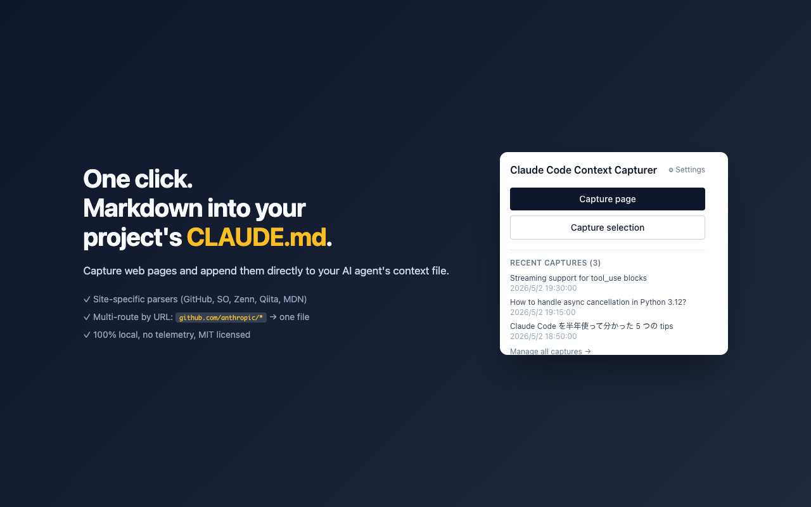
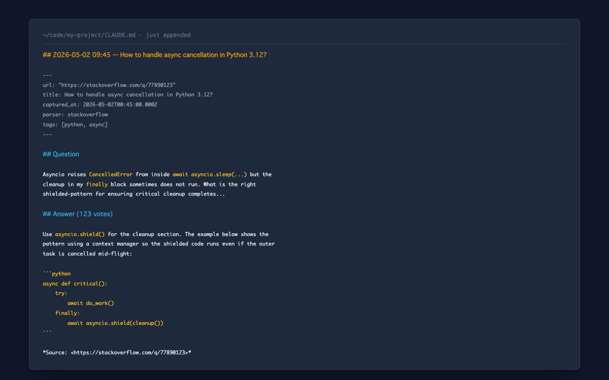
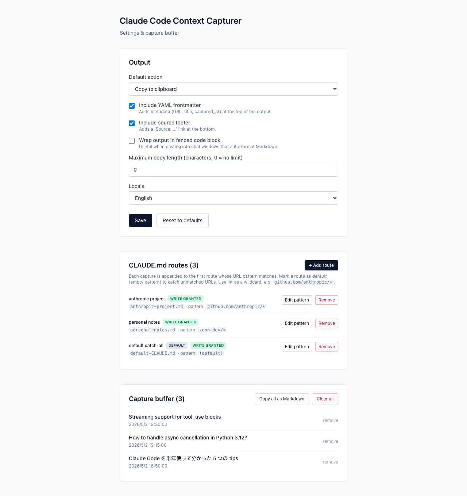
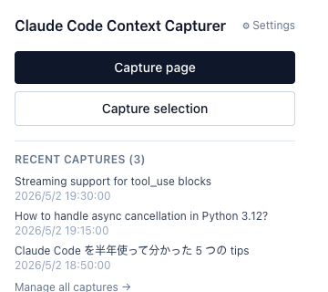

# Claude Code Context Capturer

> Capture web pages as Markdown and append them **directly to your project's `CLAUDE.md`**. Multi-project routing by URL pattern. Site-specific parsers for GitHub, Stack Overflow, Zenn, Qiita, MDN.



[English version below](#english) ・ [日本語](#日本語)

---

## <a id="日本語"></a>🎯 これは何か

Claude Code で 1 時間調べ物をして、ターミナルに戻った頃には「あの 5 つの記事の内容」が AI エージェントに伝わってない — このループを閉じる拡張機能です。

開いているページから**ノイズを除いた本文だけ**を Markdown に変換し、プロジェクトの `CLAUDE.md` に**直接 append** します。URL パターン（glob）で複数の `CLAUDE.md` を使い分けることもできます（例：`github.com/anthropic/*` → 仕事用、`zenn.dev/*` → 個人メモ）。

```yaml
---
url: https://github.com/owner/repo/issues/42
title: "[Issue] Bug: something is broken"
captured_at: 2026-04-30T12:00:00.000Z
parser: github
author: alice
tags: ["bug", "priority:high"]
---

# Bug: something is broken

The thing crashes when I do `foo()`.

## Comments

### bob

I see the same.

---

*Source: [...](https://github.com/owner/repo/issues/42)*
```

そのままチャットに貼るだけで、Claude にコンテキスト付きで質問できます。

## ✨ 機能

- **ワンクリック抽出**：ツールバーアイコンまたはキーボードショートカットで開いているページを Markdown 化
- **選択範囲モード**：テキスト選択時はその部分だけを抽出
- **サイト別最適化**：以下のサイトで専用パーサーが動作
  - GitHub（Issue / Pull Request / Discussion / README）
  - Stack Overflow / Stack Exchange
  - Zenn
  - Qiita
  - MDN Web Docs
  - その他のサイトは Mozilla Readability で本文抽出
- **メタ情報の埋め込み**：URL・タイトル・取得日時を YAML frontmatter で付与
- **CLAUDE.md への直書き** *(v0.2.0+)*：プロジェクトの `CLAUDE.md` を一度ピックすれば、以降のキャプチャは File System Access API 経由で自動 append。コピペ不要
- **マルチプロジェクト振り分け** *(v0.3.0+)*：URL パターン（glob）で複数の CLAUDE.md を使い分け。例：`github.com/anthropic/*` → anthropic 用、`zenn.dev/*` → 個人メモ、無マッチは default ルート
- **claude.ai 会話のキャプチャ** *(v0.4.0+)*：claude.ai でブレストした会話をワンクリックで CLAUDE.md に流し込み。share リンクの 403 問題、手コピペの労力を解消。内部 API を叩いて thinking blocks・tool_use・branch 構造まで保持
- **キャプチャバッファ**：複数ページをまとめて溜めて、後から一括エクスポート
- **キーボードショートカット**：
  - `Ctrl+Shift+L`（macOS: `Cmd+Shift+L`）：ページ全体
  - `Ctrl+Shift+K`（macOS: `Cmd+Shift+K`）：選択範囲
- **コンテキストメニュー**：右クリックから直接キャプチャ
- **設定可能**：frontmatter の有無、フッター、文字数上限、ロケール（en / ja）など

## 📸 スクリーンショット

**実際に CLAUDE.md に書き込まれる内容:**



**マルチプロジェクトルーティング設定:**



## 🆚 既存の Web→Markdown 拡張との違い

正直に言うと、Web ページを Markdown 化する Chrome 拡張は他にも **[LLMFeeder](https://github.com/jatinkrmalik/LLMFeeder)**、**[Save](https://www.savemarkdown.co/)**、**[Context Collector](https://github.com/jerilseb/context-collector)** などが既にあります。それらとの違い：

| 機能 | LLMFeeder | Save | Context Collector | **この拡張** |
|---|---|---|---|---|
| Web → Markdown 変換 | ✓ | ✓ | ✓ | ✓ |
| クリップボードに出力 | ✓ | ✓ | ✓ | ✓ |
| **プロジェクトの実ファイル `CLAUDE.md` に直接書き込み** | ✗ | ✗（独自 Vault） | ✗ | **✓** |
| **URL パターンで複数ファイルに振り分け** | ✗ | ✗ | ✗ | **✓** |
| GitHub / Stack Overflow / Zenn / Qiita / MDN サイト別パーサー | ✗ | 部分的 | ✗ | **✓** |
| **claude.ai 会話キャプチャ（thinking / tool_use / branch 保持）** | ✗ | ✗ | ✗ | **✓** |
| 100% ローカル処理・完全 OSS | ✓ | ✗（SaaS） | ✓ | ✓ |

要は「**Claude Code（や類似 AI エージェント）の context file 専用に振り切った clipper**」です。汎用 Markdown clipper が欲しいなら LLMFeeder の方が成熟しています。プロジェクトの `CLAUDE.md` を自動メンテしたいなら、これがおそらく現状唯一の選択肢です。

## 🚀 インストール

### Chrome ウェブストア（推奨）

[Coming soon - 審査中]

### 開発版を直接インストール

```bash
git clone https://github.com/OceansCreative/claude-code-context-capturer.git
cd claude-code-context-capturer
npm install
npm run build
```

その後 Chrome で：

1. `chrome://extensions/` を開く
2. 右上の「デベロッパーモード」を ON
3. 「パッケージ化されていない拡張機能を読み込む」をクリック
4. このリポジトリの `dist/` ディレクトリを選択

## 💡 使い方



### ページ全体をキャプチャ

ツールバーの拡張機能アイコンをクリック → 「Capture page」ボタン。
または `Ctrl+Shift+L`（macOS: `Cmd+Shift+L`）。

### 選択範囲だけをキャプチャ

ページ上でテキストを選択 → 拡張機能アイコン → 「Capture selection」。
または `Ctrl+Shift+K`（macOS: `Cmd+Shift+K`）。

### バッファに溜めてあとで一括エクスポート

設定画面（拡張機能アイコン右上の ⚙）で「Default action」を **Append to buffer** または **Both** に変更すると、キャプチャがバッファに蓄積されます。設定画面の「Copy all as Markdown」で全件まとめてエクスポートできます。

### 設定をカスタマイズ

設定画面で以下を変更できます：

| 設定 | 説明 |
|---|---|
| Default action | キャプチャ時の動作（クリップボード / バッファ / リンク済み CLAUDE.md / 両方） |
| Include YAML frontmatter | メタ情報の付与 |
| Include source footer | フッターに出典 URL を付ける |
| Wrap output in fenced code block | コードブロックで囲む（チャット直貼り用） |
| Maximum body length | 本文の最大文字数（0 = 無制限） |
| Locale | en / ja |
| CLAUDE.md routes | 複数の `CLAUDE.md` を URL パターンで振り分け（v0.3.0+） |

## 🛠️ 開発

### 必要環境

- Node.js 20+
- npm

### コマンド

```bash
npm install        # 依存関係のインストール
npm run dev        # 開発モード（HMR 付き）
npm run build      # 本番ビルド
npm test           # テスト実行
npm run lint       # Lint
npm run format     # Prettier でフォーマット
```

### プロジェクト構成

```
src/
├── background/        # Service worker（コマンド受信・配送）
├── content/
│   ├── index.ts       # コンテントスクリプトエントリ
│   └── parsers/       # サイト別パーサー
├── popup/             # ポップアップ UI（React）
├── options/           # 設定画面（React）
├── shared/            # 共通ロジック（Markdown 変換、ストレージなど）
└── manifest.config.ts # Manifest V3 定義
```

### サイト別パーサーの追加

新しいサイトに対応したい場合、以下の手順で追加できます：

1. `src/content/parsers/yoursite.ts` を作成
2. `canHandleYourSite(): boolean` と `parseYourSite(): CapturedContext | Promise<CapturedContext>` をエクスポート
   - DOM だけでパース可能なら同期、内部 API fetch が必要なら async（v0.4.0+ の dispatcher は async 化済み）
3. `src/content/parsers/dispatcher.ts` で先頭に追加（より具体的なホスト判定が先に来るよう順序に注意）
4. `src/shared/types.ts` の `ParserName` に追加
5. `tests/parsers/yoursite.test.ts` でテストを追加（fetch を使う場合は `vi.fn()` でモック — `tests/parsers/claude-ai.test.ts` を参考に）

Pull Request 歓迎です。

## 📜 ライセンス

MIT License - [LICENSE](./LICENSE) を参照。

自由に fork ・改変・商用利用してください。

## 🙋 つくったひと

開発・メンテナンス：**池田和司（[OceansBase](https://oceans-base.com)）**

[OceansBase](https://oceans-base.com) は島根県を拠点とする個人事業屋号で、受託開発・IT コンサル・コンテンツ制作を行っています。

## 🔗 関連プロジェクト

Claude Code エージェント集シリーズ：
- [claude-code-c-suite-agents](https://github.com/OceansCreative/claude-code-c-suite-agents) - 汎用 13 エージェント
- [claude-code-agents-meo-shop](https://github.com/OceansCreative/claude-code-agents-meo-shop) - 店舗ビジネス向け
- [claude-code-agents-jisaa](https://github.com/OceansCreative/claude-code-agents-jisaa) - 士業向け
- [claude-code-agents-saas-founder](https://github.com/OceansCreative/claude-code-agents-saas-founder) - SaaS 創業者向け

---

<a id="english"></a>

# Claude Code Context Capturer (English)

> A Chrome extension that captures web pages as Markdown and writes them **directly to your project's `CLAUDE.md`**. Multi-project routing by URL pattern.

## What it does

When you research with Claude Code (or any AI coding agent), you read 5 articles for an hour, switch to your terminal, and the agent has none of that context. This extension closes that loop: every page you capture is appended to your project's `CLAUDE.md` so the next session starts where your reading ended.

URL globs let you maintain separate `CLAUDE.md` files per project — `github.com/anthropic/*` to one file, `zenn.dev/*` to another, unmatched URLs to a default catch-all.

## Screenshots

**What lands in your `CLAUDE.md`:**


**Multi-route configuration:**


## How is this different from existing Markdown clippers?

Honestly, several Web→Markdown extensions already exist: **[LLMFeeder](https://github.com/jatinkrmalik/LLMFeeder)**, **[Save](https://www.savemarkdown.co/)**, **[Context Collector](https://github.com/jerilseb/context-collector)**, and the venerable **MarkDownload**. This one's differentiation:

| Feature | LLMFeeder | Save | Context Collector | **This extension** |
|---|---|---|---|---|
| Web → Markdown conversion | ✓ | ✓ | ✓ | ✓ |
| Clipboard output | ✓ | ✓ | ✓ | ✓ |
| **Direct write to your project's `CLAUDE.md`** | ✗ | ✗ (own vault) | ✗ | **✓** |
| **URL-pattern routing to multiple files** | ✗ | ✗ | ✗ | **✓** |
| Site-specific parsers (GitHub / SO / Zenn / Qiita / MDN) | ✗ | partial | ✗ | **✓** |
| **claude.ai conversation capture (thinking / tool_use / branches preserved)** | ✗ | ✗ | ✗ | **✓** |
| 100% local, fully OSS | ✓ | ✗ (SaaS) | ✓ | ✓ |

In short: a clipper purpose-built for AI agent context files. If you want a general-purpose Markdown clipper, LLMFeeder is more mature. If you want to keep your project's `CLAUDE.md` continuously up to date with your reading, this is currently your only option.

## Features

- **One-click capture** — Toolbar icon or keyboard shortcut
- **Selection mode** — Capture only what you've selected
- **Site-specific parsers** for GitHub, Stack Overflow, Zenn, Qiita, MDN
- **YAML frontmatter** with URL, title, captured_at, author, tags
- **Direct CLAUDE.md write** *(v0.2.0+)* — Link a `CLAUDE.md` once via the File System Access API; subsequent captures append directly, no copy/paste
- **Multi-project routing** *(v0.3.0+)* — Link multiple `CLAUDE.md` files with URL glob patterns. Captures from `github.com/anthropic/*` go to one file, `zenn.dev/*` to another, unmatched URLs to a default route
- **claude.ai conversation capture** *(v0.4.0+)* — Capture your claude.ai brainstorm conversation in one click. Bypasses the 403-on-share-link issue and the manual copy-paste loop. Hits claude.ai's internal API to preserve thinking blocks, tool_use entries, and branch structure that DOM scraping would miss
- **Buffer mode** — Stack multiple captures and export all at once
- **Keyboard shortcuts**:
  - `Ctrl+Shift+L` (Cmd+Shift+L on macOS) — capture page
  - `Ctrl+Shift+K` (Cmd+Shift+K on macOS) — capture selection
- **Context menu** — Right-click to capture

## Installation

### Chrome Web Store (recommended)

[Coming soon - in review]

### Manual install

```bash
git clone https://github.com/OceansCreative/claude-code-context-capturer.git
cd claude-code-context-capturer
npm install
npm run build
```

Then in Chrome:

1. Go to `chrome://extensions/`
2. Enable "Developer mode" (top right)
3. Click "Load unpacked"
4. Select the `dist/` directory of this repository

## Adding a new site parser

Pull requests are welcome! To add support for a new site:

1. Create `src/content/parsers/yoursite.ts`
2. Export `canHandleYourSite(): boolean` and `parseYourSite(): CapturedContext | Promise<CapturedContext>` — sync if DOM-only, async if you need to call the site's internal API (the dispatcher has been async since v0.4.0)
3. Register it at the top of `src/content/parsers/dispatcher.ts` (order matters: more specific host checks first)
4. Add the name to `ParserName` in `src/shared/types.ts`
5. Add tests in `tests/parsers/yoursite.test.ts` — see `tests/parsers/claude-ai.test.ts` for an example with mocked `fetch`

## License

MIT — free to fork, modify, and use commercially.

## Author

Maintained by **Kazushi Ikeda** ([OceansBase](https://oceans-base.com)) — solo IT consulting practice in Shimane, Japan.
